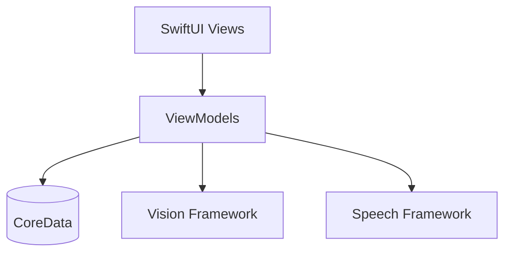

# FridgeFriend Architecture Overview

## Current Implementation vs. Future Goals

Hey there! This is the architecture documentation for FridgeFriend, an ITEL315 iOS Development course project. I'll be honest about where we are now and where I want to take this project.

## Current Architecture



> **Learning Note**: Currently using a simplified MVVM pattern. It's not perfect, but I'm learning and improving!

### What We Have Now

#### 1. Views (SwiftUI)
```swift
struct InventoryView: View {
    @StateObject private var viewModel = InventoryViewModel() // DI needed here
    // View implementation
}
```

#### 2. ViewModels
```swift
class InventoryViewModel: ObservableObject {
    @Published var items: [Item] = []
    let persistence = PersistenceController.shared // Should use DI
    // Business logic
}
```

#### 3. Data Layer
```swift
// Currently using direct CoreData access
// TODO: Implement repository pattern
class PersistenceController {
    static let shared = PersistenceController()
    // CoreData setup
}
```

## Known Architecture Challenges

### Current Limitations
1. **Tight Coupling**
   - Views directly instantiate ViewModels
   - Singleton usage for data access
   - No proper dependency injection

2. **Missing Patterns**
   - No repository layer
   - Limited error handling
   - Basic MVVM implementation

3. **Testing Challenges**
   - Hard to unit test (due to tight coupling)
   - No mocking infrastructure
   - Limited separation of concerns

## Where I Want to Take This

### Phase 1: Better MVVM
```swift
// Goal: Proper dependency injection
protocol InventoryRepository {
    func fetchItems() async throws -> [Item]
    func saveItem(_ item: Item) async throws
}

class InventoryViewModel {
    private let repository: InventoryRepository // Injected
    init(repository: InventoryRepository) {
        self.repository = repository
    }
}
```

### Phase 2: Clean Architecture

```
FridgeFriend/
├── Features/
│   ├── Inventory/
│   │   ├── Domain/
│   │   ├── Data/
│   │   └── Presentation/
│   └── Recipe/
│       ├── Domain/
│       ├── Data/
│       └── Presentation/
└── Core/
    ├── Common/
    └── Extensions/
```

## Current Implementation Details

### 1. UI Layer (SwiftUI)
- Using SwiftUI Views
- Basic MVVM binding
- Some reusable components

**Example**:
```swift
struct ItemRow: View {
    let item: Item
    
    var body: some View {
        HStack {
            Text(item.name)
            Spacer()
            Text(item.expiryDate, style: .date)
        }
    }
}
```

### 2. Business Logic
- ViewModels handle logic
- Direct CoreData access (to be improved)
- Basic error handling

### 3. Data Persistence
- CoreData for storage
- Basic CRUD operations
- No abstraction layer yet

## Learning Journey & Improvements

### What I've Learned
1. MVVM Basics
2. SwiftUI State Management
3. CoreData Integration

### What I'm Working On
1. Dependency Injection
2. Repository Pattern
3. Better Error Handling

### Future Learning Goals
1. Clean Architecture
2. Unit Testing
3. Design Patterns

## Honest Assessment

### What Works Well
- Basic MVVM structure
- SwiftUI integration
- Core features functioning

### What Needs Work
- Dependency management
- Code organization
- Testing infrastructure

## Implementation Examples

### Current Pattern
```swift
// Current implementation (needs improvement)
class RecipeViewModel: ObservableObject {
    @Published var recipes: [Recipe] = []
    
    func fetchRecipes() {
        // Direct CoreData access (not ideal)
        let context = PersistenceController.shared.container.viewContext
        // ... fetch implementation
    }
}
```

### Future Pattern
```swift
// Where I want to take it
protocol RecipeRepository {
    func fetchRecipes() async throws -> [Recipe]
}

class RecipeViewModel: ObservableObject {
    private let repository: RecipeRepository
    
    init(repository: RecipeRepository) {
        self.repository = repository
    }
    
    func fetchRecipes() async {
        do {
            recipes = try await repository.fetchRecipes()
        } catch {
            // Proper error handling
        }
    }
}
```

## Notes for Contributors & Learning

### Current State
- Educational project
- Learning in progress
- Open to improvements

### How to Contribute
1. Understand current limitations
2. Suggest improvements
3. Help implement better patterns

## Resources I'm Using

- [Swift Style Guide](https://google.github.io/swift/)
- [Clean Architecture with SwiftUI](https://nalexn.github.io/clean-architecture-swiftui/)
- [Swift SOLID Principles](https://www.swiftbysundell.com/articles/solid-principles-applied-to-swift/)

---

> **Learning Note**: This architecture documentation reflects my current understanding and implementation. It's a work in progress, and I'm actively learning and improving! 
